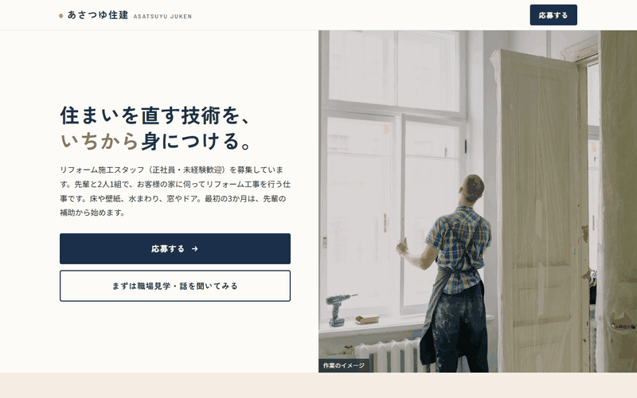

# あさつゆ住建 リフォーム施工スタッフ 採用LP

株式会社あさつゆ住建（架空）の採用LPを、Claude Codeで設計〜実装しました。

副業ポートフォリオ用の作品例です。あさつゆ住建は、地域密着の住宅リフォーム会社という設定の**架空の会社**で、実在の会社・求人ではありません（ページのフッターにも同じ旨を表示しています）。応募フォームはダミーで、応募することはできません。

**公開ページ：https://tmy-adc329.github.io/asatsuyu-lp/**

## デモ

`index.html` をブラウザで直接開くだけで表示できます（ビルド不要。CSS/JSはHTMLにインライン）。

## これは何

住宅リフォーム会社「株式会社あさつゆ住建」の、リフォーム施工スタッフ（正社員・未経験歓迎）を募集する採用LPです。GijiLog（登録型）、atelier soyogi（予約型）、mizuhane（購入型）に続く、**応募型**の作例です。

想定ターゲットは、販売・飲食・工場などの仕事から、手に職がつく仕事に移りたいと考えている人です。応募前の不安として多い「未経験で大丈夫か」「体力的にきつくないか」「給料と休み」「どんな人と働くのか」に、順番に答えていく構成にしています。

## ページ構成

| # | セクション | 役割 |
|---|---|---|
| 1 | ヒーロー | 作業写真とキャッチコピー、「応募する」「まずは職場見学・話を聞いてみる」の2つのボタン |
| 2 | こんな方に向いている仕事です | 気持ちではなく、具体的な行動・適性を4点の箇条書きで |
| 3 | あさつゆ住建の仕事 | 3種類の仕事を、写真と文章の左右交互で。作業の例と日数（例：6畳の床の張り替え 1〜2日）と、体力面と安全のこと |
| 4 | 入社してからの3年間 | 担当の先輩と週1回の振り返り、入社〜3か月／〜1年／〜3年の目安、資格取得支援 |
| 5 | 1日の流れ（例） | 8:00〜17:00のタイムライン（休憩は合計90分） |
| 6 | 数字で見る あさつゆ住建 | 年間休日・月の平均残業・有給休暇の平均取得・平均勤続年数 |
| 7 | 先輩の声 | 1人分のインタビュー枠（レイアウトのみ。下記「設計の考え方」参照） |
| 8 | 募集要項 | 給与と、募集時に明示が必要な労働条件の表 |
| 9 | 選考の流れ | 応募 → 面接（1回・約60分）→ 1週間以内に結果をメールでお知らせ |
| 10 | よくある質問 | 開閉式のQ&A（7問） |
| 11 | 応募フォーム | 「応募する」と「見学・話を聞きたい」を同じフォームで受け付ける |
| 12 | フッター | 会社情報と、架空の会社であることの注記 |

スマートフォン幅から組み始め、タブレット・デスクトップ幅へ段階的にレイアウトを広げています。

## 応募フォーム

応募フォームは**ダミー送信**です。「送信する」を押しても実際には送信されず、入力内容をブラウザのコンソールに出力し、画面に「デモのため実際には送信されていません」と表示するだけです。

- 項目：ご希望（応募する・見学や話を聞きたい の2択）／お名前／メールアドレス／電話番号（任意）／現在のご職業（任意）／ご質問（任意）
- ヒーローの「応募する」「見学」ボタンから来た場合は、ご希望が選択済みになります
- 実際の送信サービス（SSGformなど）に後から差し替えやすいよう、素直な `<form>` にしています

## 設計の考え方

**求人広告のルールに合わせて書く。** 架空の作例でも、実案件と同じく職業安定法などのルールに沿って書いています。

- 職業安定法で募集時に明示が必要な労働条件（仕事内容、契約期間、試用期間、就業場所、勤務時間・休憩、休日、時間外労働、賃金、加入保険、募集者の名称、受動喫煙防止措置）を、募集要項の表にすべて載せています。2024年4月に追加された「仕事内容の変更の範囲」「就業場所の変更の範囲」も入れています（有期契約の更新上限は、期間の定めのない正社員の募集のため該当なし）。なお、架空の会社のため、就業場所の所在地だけは未確定の表示にしています
- 「若手活躍中」「男性スタッフ募集」のような、年齢・性別を限定・優先する表現は使っていません。写真も後ろ姿・手元が中心のものを選んでいます
- 固定残業代は含めていません（残業した分は全額支給）

**安心材料は、気持ちではなく事実で書く。** 「未経験歓迎」「やる気があれば大丈夫」を繰り返すと、「誰でもいいから人が欲しい」「きつい仕事を根性で乗り切る」会社に見えてしまうため、具体的な事実で答えるようにしています。

- 休日：年間休日120日（完全週休2日制に加えて、GW・夏季・年末年始の休暇）、有給休暇は昨年度の平均で12日取得
- 残業：月平均10時間程度。年度末など工事が集中する時期は増えることがある、と正直に書いています
- 教え方：担当の先輩が1人つき、週に1回、できるようになったことと次の目標を一緒に確認する
- 安全対策：重いものは必ず2人で運び、台車も使う。ヘルメット・安全靴・手袋は会社が支給。夏場は休憩を多めに取る
- 定着：平均勤続年数9年

**写真は「人」ではなく「仕事・道具・住まい」を主役にする。** フリー素材（Unsplash / Pexels）をクライアント支給の写真とみなして使っています。

- 人物が写った写真は、顔が写らない後ろ姿のものだけを使い、「当社スタッフ」として見せないよう「作業のイメージ」と表示しています
- 完成した部屋の写真は「施工事例」とは書かず、「仕上がった住まいのイメージ」と表示しています
- 工具のラベルなどが写り込んでいる写真は使っていません
- 先輩の声は、架空の名前・体験談を書くと作り話を本物のように見せることになるため、インタビューの枠だけを作り、回答は画面上でも見本と分かる表示にしています

**あとから直す人が迷わないようにする。** 受託を想定し、納品後にクライアント側で手を入れやすい形にしています。

- ブランドカラー（ネイビー）は `:root` の `--brand` 1行だけで変更できます。淡い色・濃い色はそこから `color-mix()` で自動生成しています
- 所在地や先輩スタッフのインタビューなど、実際の情報が必要な箇所は仮の文章で埋めず、`<!-- CLIENT: ... -->` コメントを付けたうえで、画面上でも未確定であることが分かる表示にしています

**参考デザインは「咀嚼して使う」。** 配色や構成の参考にはCanvaのテンプレートを複数使いましたが、特定の1枚を模倣せず、ネイビー×ライトブラウンの配色、写真を大きく使った仕事紹介、仕事内容から募集要項・応募へつなぐ流れといった要素を組み合わせて独自の構成にしています。テンプレートの画像や素材そのものは使っておらず、リポジトリにも含めていません（Canvaの規約上、テンプレートの再配布にあたるため）。

## 写真の出典

写真はすべて Unsplash / Pexels のフリー素材（商用利用可）です。Web表示用に縮小しています。

| ファイル | 撮影者 / サイト | 元の写真 |
|---|---|---|
| `images/01_hero_window-install.jpg` | Ksenia Chernaya / Pexels | https://www.pexels.com/photo/faceless-handyman-installing-window-in-new-house-5691550/ |
| `images/02_work_window-side.jpg` | Ksenia Chernaya / Pexels | https://www.pexels.com/photo/unrecognizable-workman-installing-window-in-new-apartment-5691521/ |
| `images/03_site_renovation-room.jpg` | Ksenia Chernaya / Pexels | https://www.pexels.com/photo/modern-flat-interior-with-doorway-during-renovation-process-5691533/ |
| `images/04_tools_windowsill.jpg` | Ksenia Chernaya / Pexels | https://www.pexels.com/photo/assorted-joinery-tools-on-windowsill-in-house-5691537/ |
| `images/07_finish_kitchen.jpg` | Francesca Tosolini / Unsplash | https://unsplash.com/photos/brown-and-beige-kitchen-interior-lIVK3z606og |
| `images/08_finish_hallway.jpg` | Josh Lemmon / Unsplash | https://unsplash.com/photos/hallway-with-grey-walls-and-doors-jHLMUAW-nFc |
| `images/09_training_blueprint.jpg` | Lucas Kepner / Unsplash | https://unsplash.com/photos/architectural-blueprints-with-drafting-tools-Yn8D5B8C-eY |
| `images/10_tools_rack.jpg` | Barn Images / Unsplash | https://unsplash.com/photos/assorted-handheld-tools-in-tool-rack-t5YUoHW6zRo |
| `images/11_bg_wood-floor.jpg` | Alex Cooper / Unsplash | https://unsplash.com/photos/close-up-of-a-wooden-parquet-floor-pattern-K6vkTjYciX8 |

## 技術スタック

- HTML / CSS / JavaScript（フレームワーク・ビルドツールなし、HTMLにインライン）
- Google Fonts（Zen Kaku Gothic New / Noto Sans JP / Barlow）

## 開発について

設計と実装には Claude Code（AIコーディング支援）を使っています。
仕様（会社の設定、ターゲット、CTA、募集要項、トーン、求人広告の表現ルール、写真の扱い、スコープ外の線引き）は
[brief.md](./brief.md) にまとめています。

## 今回やらないこと（スコープ外）

- 実際の応募送信（ダミー送信）
- 求人サイト（Indeedなど）との連携、求人の構造化データ
- 地図の埋め込み
- ロゴのデザイン（テキストロゴで代替）
- 多言語対応

## ライセンス

個人のポートフォリオ／学習プロジェクトです。現時点でライセンスファイルは設定していません（無断転載・改変・商用利用は不可）。再利用可能な形にしたい場合は別途ライセンスを設定します。写真の権利は各撮影者に帰属し、Unsplash License / Pexels License に従います。
